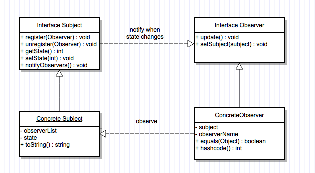

# observer_design_pattern

#Intent

Define a one-to-many dependency between objects so that when one object changes state, all its dependents are notified and updated automatically.

Also known as "Dependents" or "Publish-Subscribe".

#Motivation

A common side-effect of paritioning a system into a collection of cooperating classes is the need to maintain consistency between related objects. You don't want to achieve consistency by making the classes tightly coupled, because that reduces their reusability.

The Observer pattern describes how to establish these relationships.  The key objects in the observer pattern are "subject" and "observer".  A subject may have any number of dependent observers.  All observers are notified whenever the subject undergoes a change in state.  In response, each observer will query the subject to synchronize its state with the subject's state.

This kind of interaction is known as "publish-subscribe".  The subject is the publisher of notifications.  It sends out these notifications without having to know who its observers are.  Any number of observers can subscribe to receive notifications.

#Applicablility

Use the Observer pattern in any of the following situations:
1) When an abstraction has two aspects, one dependent on the other.

2) When a change to one object requires changing others, and you don't know howmany objects need to be changed.

3) When an object should be able to notify other objects without making assumptions about who these objects are (avoid tightly coupled objects).

#Participants

Subject

-knows its observers
-any number of observer objects may observe an object
-provides an interface for attaching and detaching observer objects

Observer

-defines an updating interface for objects that should be notified of changes in a subject

ConcreteSubject

-stores state of interest to ConcreteObserver objects
-sends a notification to its observers when its state changes

ConcreteObserver

-maintains a reference to ConcreteSubject object
-stores state that should stay consistent with a subjects
-implements the observer updating interface to keep its state consistent with the subjects

#Problem solved in example

The observer pattern is meant to solve the problem of notifying classes of a change from another class without tightly coupling the classes together.

To demonstrate this, this demo has 3 main classes:

1) the Main class (which is responsible for instantiating the Observer and Subject implementations)

2) the Subject class (which keeps track of the observer classes and represents the object that the observers care about the state of)

3) the Observer class (which represent the classes that should be notified when a change occurs)

When the program starts, several Observer instances are created and registered to the Subject instance.  When the Subject instance changes its state, this also triggers a notifcation to the Observer classes that a change has occurred.  This in turn, causes an action in them as well.

